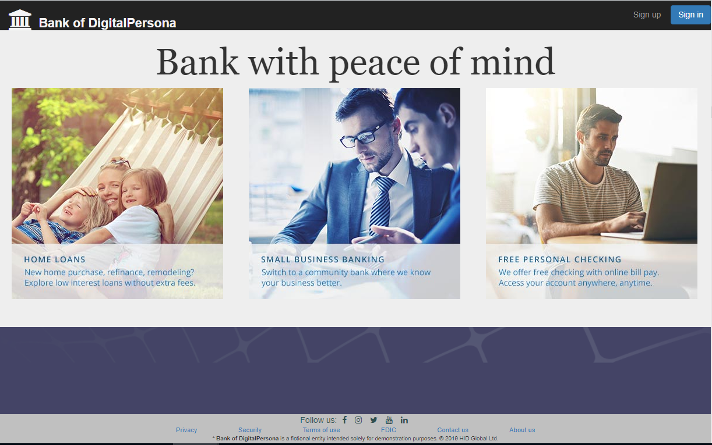
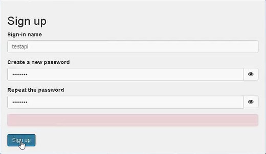
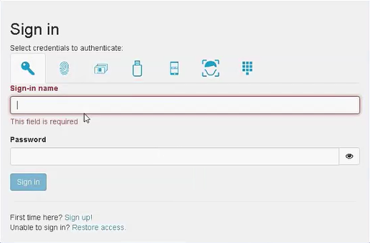
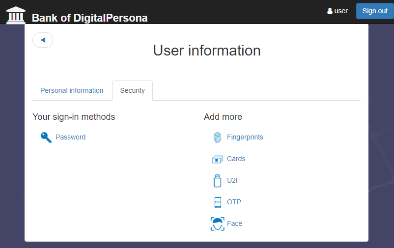

  
# Run the server

## Prepare

The server uses the [`supervisor`](https://www.npmjs.com/package/supervisor) package to ensure that the server is running continuously.

Before starting the server, install the `supervisor` NPM package globally:
```
npm install supervisor -g
```

## Start the server

To start the server in production mode, open a terminal console and run:
```
npm run server
```
> NOTE: Your DP Web Components must use a valid TLS certificate signed
by a trusted certification authority (CA). Self-signed certificate won't be accepted, even if you add it into a trusted root CA container.

To start the server in development mode:
```
npm run server-dev
```
>Development mode allows you to use a self-signed TLS certificate for development purposes. Do not use them in production!

## Open the demo application

Once the server is started, open the  main page of the sample in your web browser.  



Click *Sign up* to create a demo account,  



then sign in with your newly created password.



Click your user name to display your user information and select the Security tab to add more authentication methods and start using multifactor authentication.



## Stop or restart the server

To stop the server, press *Ctrl-C* in the terminal console.

To force restart the server, press *rs* in the terminal console.
